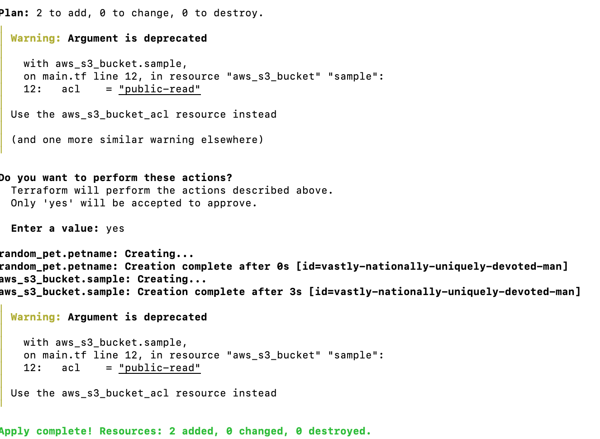
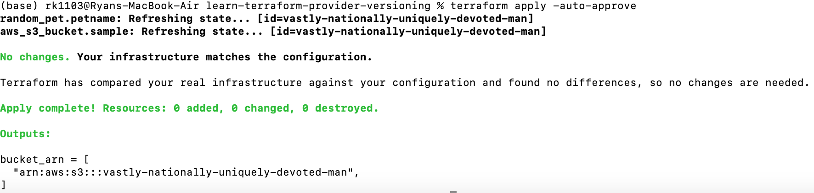
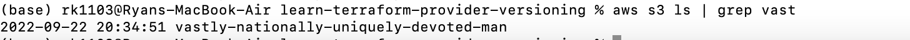
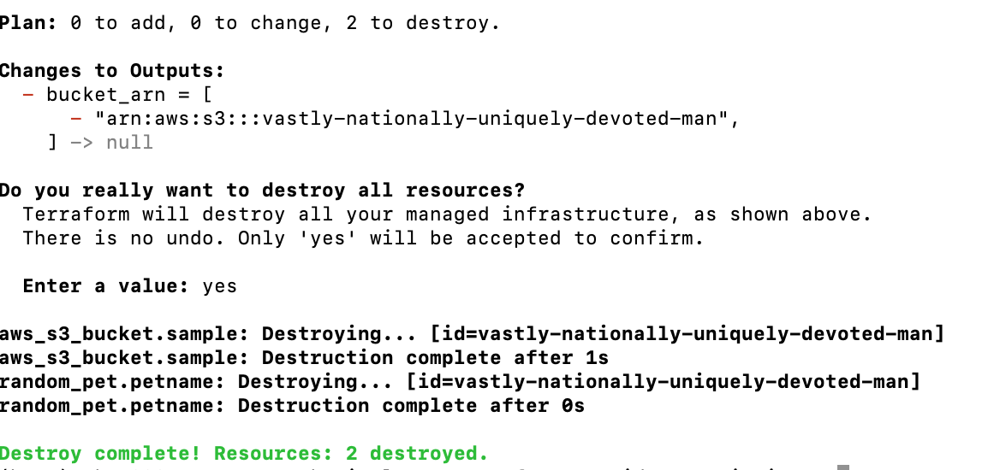

In the `terraform.tf` file, the terraform block which specifies the required 
provider version and required Terraform version for this configuration.

The terraform block contains the required_providers block, which specifies the provider local name, the source address,
and the version. When you initialize this configuration, Terraform will download:

* Version 3.0.0 of the random provider.
* The latest version of the AWS provider that is at greater than 2.0.0. The >= version constraint operator specifies 
  the minimum provider version that is compatible with the configuration.
The Terraform block also specifies that only Terraform binaries newer than v1.1.x can run this configuration by using the >= operator as well.
  
The `main.tf` file uses the AWS and random providers to deploy a randomly named S3 bucket to the us-east-1 region.
The "random" provider allows the use of randomness within Terraform configurations. This is a logical provider, which means 
that it works entirely within Terraform's logic, and doesn't interact with any other services.

When you initialize a Terraform configuration for the first time with Terraform 1.1 or later, Terraform will generate 
a new .terraform.lock.hcl file in the current working directory. You should include the lock file in your version 
control repository to ensure that Terraform uses the same provider versions across your team and in 
ephemeral remote execution environments.

Notice the two providers specified in your terraform.tf file. The AWS provider version is v4.31.0 and fulfills its version constraints.
As of 22 Sep 2022, it is the latest version of the AWS provider on https://registry.terraform.io/providers/hashicorp/aws/latest
However, it will lock the provider to this version, even if there is a newer version in future.
The random provider is set to v3.0.0 and fulfills its version constraints.

 check the bucket arn created

and list bucket from the aws cli 

Destroy all resources

