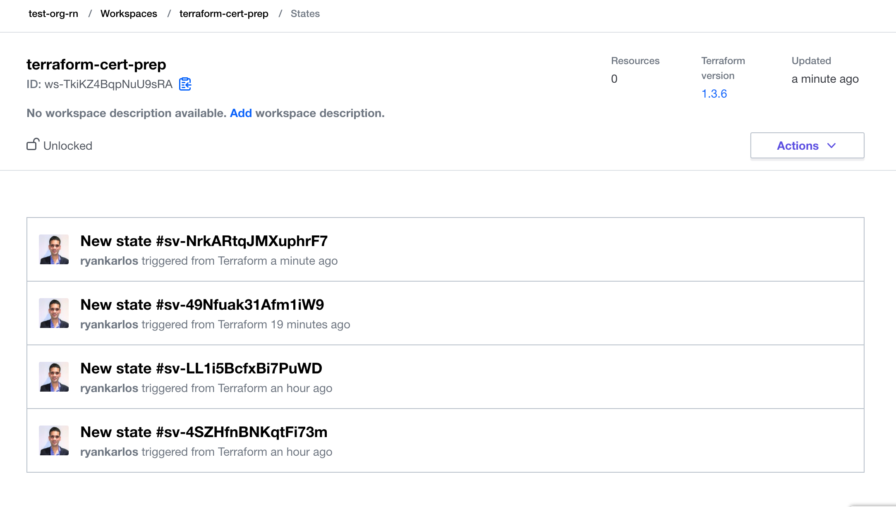

## Integrating with Terraform cloud

This example follows this hashicorp tutorial https://developer.hashicorp.com/terraform/tutorials/cloud-get-started
We will create an ec2 instance in AWS using terraform module https://registry.terraform.io/modules/terraform-aws-modules/ec2-instance/aws/latest
and manage state remotely in Terraform cloud. 

In Terraform Cloud, your resources are organized by workspaces, which contain your resource definitions, 
environment and input variables, and state files. A Terraform operation occurs within a workspace, and 
Terraform uses the configuration and state for that workspace to modify your infrastructure.

Terraform Cloud supports three workflows for your Terraform runs:

* The CLI-driven workflow, which uses Terraform's standard CLI tools to execute runs in Terraform Cloud.
* The UI/Version Control System(VCS)-driven workflow, in which changes pushed to version control repositories 
* trigger runs in the associated workspace.
* The API-driven workflow, which allows you to create tooling to interact with the Terraform Cloud API 
programmatically.
https://developer.hashicorp.com/terraform/tutorials/cloud-get-started/cloud-sign-up

In the CLI-driven workflow, you initiate Terraform operations in your Terminal, and use Terraform Cloud's 
ephemeral remote execution environments for your operations. Terraform Cloud securely stores any 
input and environment variables needed by your configuration, as well as your current and previous state 
files. The CLI-driven workflow enables collaboration and allows you to leverage the stability, security, 
and enhanced visiblity of Terraform Cloud while still using the same familiar Terraform workflow, with 
minimal additional configuration.
https://developer.hashicorp.com/terraform/tutorials/cloud-get-started/cloud-sign-up

In this example,  we will create a workspace in terraform cloud using cli rather than VCS.


### Login to Terraform cloud from cli 

The terraform login command can be used to automatically obtain and save an API token for Terraform 
Cloud, Terraform Enterprise, or any other host that offers Terraform services.
By default, Terraform will obtain an API token and save it in plain text in a local CLI configuration 
file called credentials.tfrc.json. When you run terraform login, it will explain specifically where it 
intends to save the API token and give you a chance to cancel if the current configuration is not as desired.
https://developer.hashicorp.com/terraform/cli/commands/login

```bash
terraform login
```


### Create workspace

First create new organisation "test-org-rn". An organisation can have multiple workspaces.


Then we will create a new workspace using "cli-driven-workflow". Name this workspace "terraform-cert-prep".


From the cli, we can check this workspace is created

```bash
terraform workspace list
```

We can create new workspaces `terraform workspace new <workspace-name>` if we wish and switch between workspaces
`terraform workspace select <workspace-name>`. for example, we may want to create multiple workspaces for dev and prod 
environments and manage configuration differently for each workspace. 
Terraform Workspaces also help isolating state i.e. state is managed independently in each workspace 
and this provides better flexibility for multi-environment deployments.

### Execution mode 

We will switch the execution mode to local as the AWS secrets configuration is on my local machine.
To do this, go to workspace settings and select local for execution mode.


### Build Infrastructure

Initialize the project, which downloads the aws plugin and ec2 instance module from terraform public registry
https://registry.terraform.io/modules/terraform-aws-modules/ec2-instance/aws/latest

Note: we can use `terraform get` to only download the modules in blocks specified in the `.tf` files.

```bash
terraform init
```


The variables.tf file contains the vars for ec2 instance subnets and security group id which need to
be changed to the correct ids you hav setup in your vpc settings. 

The query below will retrieve the security group ID for the default security group name.

```bash
aws ec2 describe-security-groups --filters Name=group-name,Values=default --query "SecurityGroups[0].{Name:GroupName,ID:GroupId}"
```

To get a list of subnet ids in all availability zones and all vpcs - run the following command

```bash
 aws ec2 describe-subnets  --query "Subnets[*].SubnetId" 
```

or to get it for a particular vpc, pass in vpc id in the filter argument in the cli command 

```bash
 aws ec2 describe-subnets --filter "Name=vpc-id,Values=vpc-3EXAMPLE" --query "Subnets[*].SubnetId" 
```

Now, run terraform apply to create your EC2 instance.

```bash
terraform apply
```


Finally, make sure to run `terraform destroy` to clean up the resources created.

### States 

In remote runs, Terraform Cloud automatically configures Terraform to use the workspace's state; the Terraform 
configuration does not need an explicit backend configuration.
In local execution mode runs as in this example, you can use a workspace's state by configuring the CLI 
integration and authenticating with a user token that has permission to read and write state versions
for the relevant workspace. 

In addition to the current state, Terraform Cloud retains historical state versions, which can be used to 
analyze infrastructure changes over time.  You can view a workspace's state versions from its States tab.



### Variables

In this example  we have defined all the variables locally in variables.tf file. Howevever we could also 
create workspace global and non global variable sets.  For understanding variable precedence - refer to this section in the docs:
https://developer.hashicorp.com/terraform/cloud-docs/workspaces/variables?_gl=1*1irzr5t*_ga*Mjg3MDIwODE3LjE2Njk2MDU0NTg.*_ga_P7S46ZYEKW*MTY3MjI2NTE0NS40LjEuMTY3MjI2NTMwNS4wLjAuMA..#precedence

If we were running in remote execution mode in Terraform cloud (which is the default setting), we would need to setup
an AWS credentials variable set as in https://developer.hashicorp.com/terraform/tutorials/cloud-get-started/cloud-create-variable-set

This can be done by navigatinh to your  workspace in Terraform Cloud and go to the workspace's Variables page. 
Under Workspace Variables, add your AWS_ACCESS_KEY_ID and AWS_SECRET_ACCESS_KEY as Environment Variables, making sure
to mark them as "Sensitive".